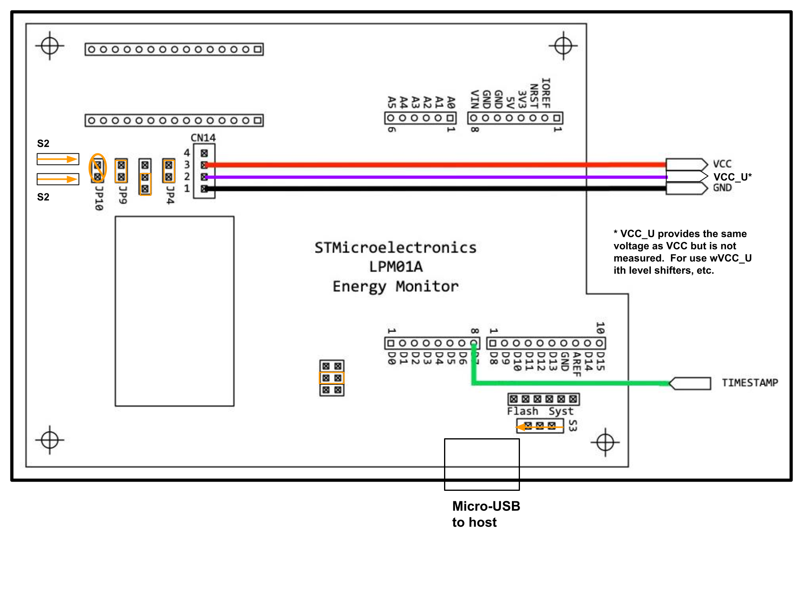
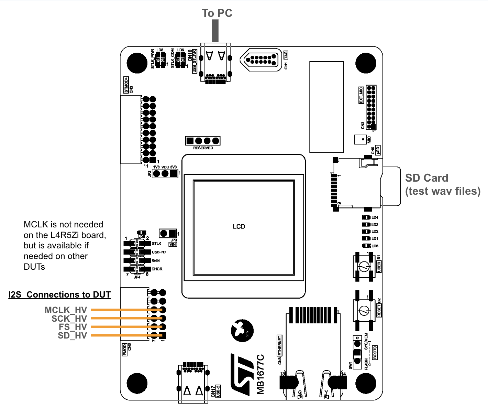
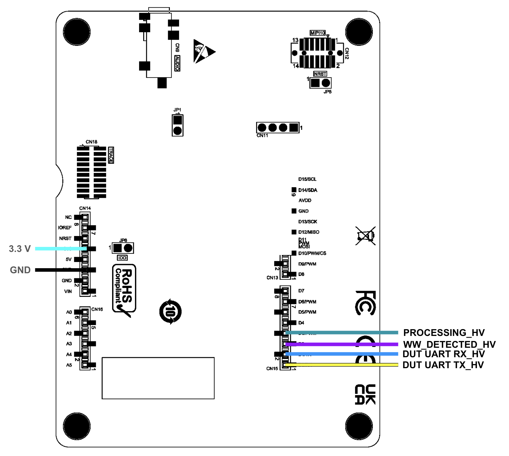
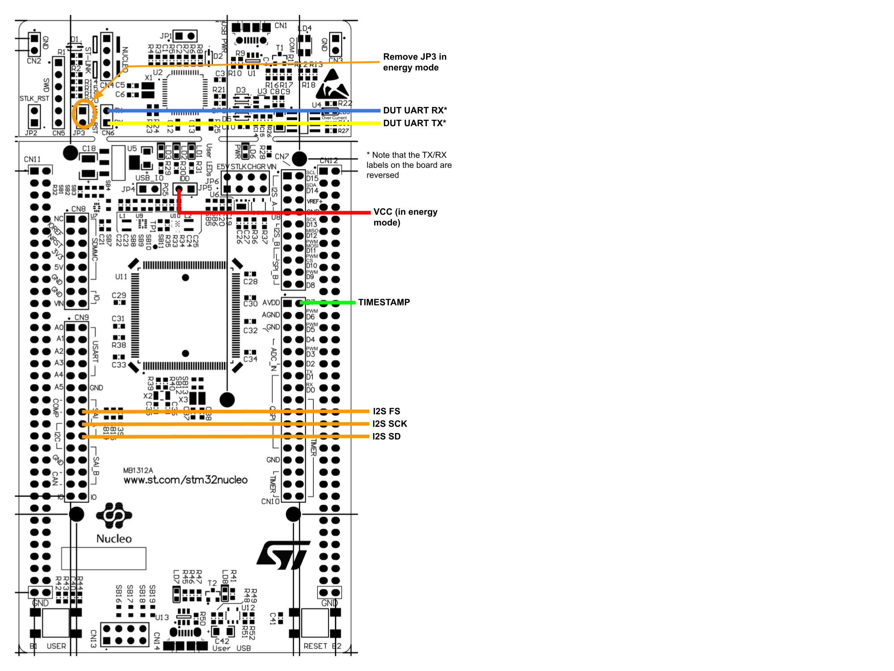

# MLPerf™ Tiny Deep Learning Benchmarks for Embedded Devices Benchmarking Tutorial
The following file contains a guide on how to run each of the benchmarks on the STM32 Nucleo reference board and how to migrate these benchmarks to new hardware.

## **Part 1** Running the STM32 Nucleo reference implementations
### System requirements
A computer with **Python 3.9** and the STM32 Cube IDE and two USB ports is required for running the benchmarks. The streaming wakeword benchmark also requires the MB1677C interface board, and any energy benchmarks also require the STMicroelectronics energy board.

### Steps for all benchmarks
Setup of an Anaconda environment for the Python portion of the benchmarks is recommended. Creation and activation of this environment with `conda` is achieved by executing

```sh
$ conda create -n tinymlperf python=3.9 && conda activate tinymlperf
```

This can be achieved with `venv` as well.

```sh
$ python3.9 -m venv ./tinymlperf && source ./tinymlperf/bin/activate
```

Once the Python 3.9 environment is activated, the requirements for both the runner application for running the benchmarks from the computer and using ARM Mbed must be downloaded using `pip`.

```sh
$ pip install -r "requirements.txt"
```

`libusb` and `pyusb` are used by the runner to interface with the boards and must be installed to run the benchmarks. On Linux, `libusb` is usually installed by default, but on macOS and Windows it must be manually installed. `libusb` can be installed on macOS using Homebrew.

```sh
$ brew install libusb
```

See [this page](https://github.com/pyusb/pyusb/blob/master/docs/faq.rst#how-do-i-install-libusb-on-windows) for information on how to install `libusb` on Windows.

### Image classification, anomaly detection, keyword spotting and person detection benchmarks
The image classification, anomaly detection, keyword spotting and person detection benchmarks use the ARM Mbed toolchain to build the binaries for the benchmark device firmware. The Mbed projects need to be set up before they can be used, which is automated through the *setup_example.sh* script located in each of the folders. Run this script from the command line after installing the required Python packages.

Next, build the firmware for the desired benchmark by executing `mbed compile -m NUCLEO_L4R5ZI -t GCC_ARM` in the benchmark directory, then flash the firmware to the board by copying the compiled .bin file to the STM32 Nucleo board. This can be achieved through the command line, through the file explorer, or through the use of the STM32 Cube Programmer application.

To run any of the tests in energy mode, connect the power board and the interface board to the reference board as shown below, and connect the interface board and the power board to the computer via USB. Load the firmware from *[interface/benchmark_interface.elf](interface/benchmark-interface.elf)* to the interface board using the STM32 Cube Programmer. Then, navigate to the `submitter_implemented.h` file in the desired benchmark, modify the line `#define EE_CFG_ENERGY_MODE 0` to `#define EE_CFG_ENERGY_MODE 1`, then recompile the firmware and load the compiled .bin file to the reference board.

The interface board runs at 3.3V, so if the DUT is running at any other supply voltage, the logic levels must be shifted.  The TXB0108, available in a [breakout board](https://www.adafruit.com/product/395) from Adafruit, support low-side voltages from 1.2V to 3.6V.

#### Power board (LPM01A)


#### Interface board (STM32H573I-DK)



#### Device under test (L4R5ZI) with level shifter


Once the hardware is configured, navigate to the [runner](./runner/) directory and execute the runner. Commands to run specific benchmarks are below.
* Image Classification
    * Energy: `python main.py --dataset_path=/path/to/datasets/ --test_script=tests_energy.yaml --device_list=devices_kws_ic_vww.yaml --mode=e`
    * Performance: `python main.py --dataset_path=/path/to/datasets/ --test_script=tests_performance.yaml --device_list=devices_kws_ic_vww.yaml --mode=p`
    * Accuracy: `python main.py --dataset_path=/path/to/datasets/ --test_script=tests_accuracy.yaml --device_list=devices_kws_ic_vww.yaml --mode=a`
* Keyword Spotting
    * Energy: `python main.py --dataset_path=/path/to/datasets/ --test_script=tests_energy.yaml --device_list=devices_kws_ic_vww.yaml --mode=e`
    * Performance: `python main.py --dataset_path=/path/to/datasets/ --test_script=tests_performance.yaml --device_list=devices_kws_ic_vww.yaml --mode=p`
    * Accuracy: `python main.py --dataset_path=/path/to/datasets/ --test_script=tests_accuracy.yaml --device_list=devices_kws_ic_vww.yaml --mode=a`
* Visual Wakewords:
    * Energy: `python main.py --dataset_path=/path/to/datasets/ --test_script=tests_energy.yaml --device_list=devices_kws_ic_vww.yaml --mode=e`
    * Performance: `python main.py --dataset_path=/path/to/datasets/ --test_script=tests_performance.yaml --device_list=devices_kws_ic_vww.yaml --mode=p`
    * Accuracy: `python main.py --dataset_path=/path/to/datasets/ --test_script=tests_accuracy.yaml --device_list=devices_kws_ic_vww.yaml --mode=a`
* Anomaly Detection:
    * Energy:  `python main.py --dataset_path=/path/to/datasets/ --test_script=tests_energy.yaml --device_list=devices_ad.yaml --mode=e`
    * Performance: `python main.py --dataset_path=/path/to/datasets/ --test_script=tests_performance.yaml --device_list=devices_ad.yaml --mode=p`
    * Accuracy: `python main.py --dataset_path=/path/to/datasets/ --test_script=tests_accuracy.yaml --device_list=devices_ad.yaml --mode=a`

### Streaming wakeword benchmark
The streaming wakeword benchmark uses the STM32 Cube SDK and consists of two parts that must be installed independently. First, open the STM32 Cube IDE and import the *[sww_ref_l4r5zi](./reference_submissions/streaming_wakeword/sww_ref_l4r5zi/)* project. Navigate to the debug configurations dialog by right-clicking the project name and selecting *Debug As -> Debug Configurations* and change the ST-Link device on the *Debugger* tab to the device plugged into the computer by pressing *Scan* and selecting the device from the drop-down menu. Then, compile and run the program by pressing the *Debug* button and pressing *Resume* when the debugger connects. Disconnect the debugger and disconnect the Nucleo reference board. Then, connect the reference board, power board and interface board in the energy measurement configuration as shown above.

The interface board has a slot for a micro-SD card. The SD card must be loaded with the WAV files containing the wakewords to be streamed from the *[runner/sww_data_dir](runner/sww_data_dir/)* folder. Ensure that it is formatted as an MS-DOS (FAT32) disk.  A 1GB card is plenty for the current benchmarks. **This data must also be stored in a folder named sww01 under the dataset path specified in the next steps otherwise the runner will fail to detect (e.g., in a the folder [evaluation/datasets/sww01](evaluation/datasets/sww01/) if the specified dataset path is [evaluation/datasets](evaluation/datasets)).**

This benchmark runs performance, accuracy and energy tests in a single run, and should be run in energy mode.

```sh
python main.py --dataset_path=/path/to/datasets/ --test_script=tests_energy.yaml --device_list=devices_sww.yaml --mode=e
```

## **Part 2** Modifying reference implementations for new platforms
Each of the reference implementations contains a submitter-implemented module with API functions that must be modified when migrating one of the reference implementations to a new platform. With the exception of the streaming wakeword reference implementation where the submitter-implemented module is named *[sww_ref_util_submitter.c](./reference_submissions/streaming_wakeword/sww_ref_l4r5zi/Core/Src/sww_ref_util_submitter.c)*, this module is named *submitter_implemented.cpp* in each of the other implementations. Documentation for how these functions are supposed to work and the required input and output values is included in *[sww_ref_util_submitter.h](./reference_submissions/streaming_wakeword/sww_ref_l4r5zi/Core/Src/sww_ref_util_submitter.h)* for the streaming wakeword reference implementation and in *submitter_implemented.h* for the other benchmarks.

Once the submitter functions are implemented, verify the baud rate in the file *[device_under_test.py](./runner/device_under_test.py)* is correct and modify the *devices* YAML files in the *runner* folder for the new platform.

## Further information
More information on how to use the provided reference implementations or how to transition the provided reference implementations to new platforms not covered here is located in the README.md files located in the *[reference_submissions](reference_submissions/)* folder and its subfolders.
