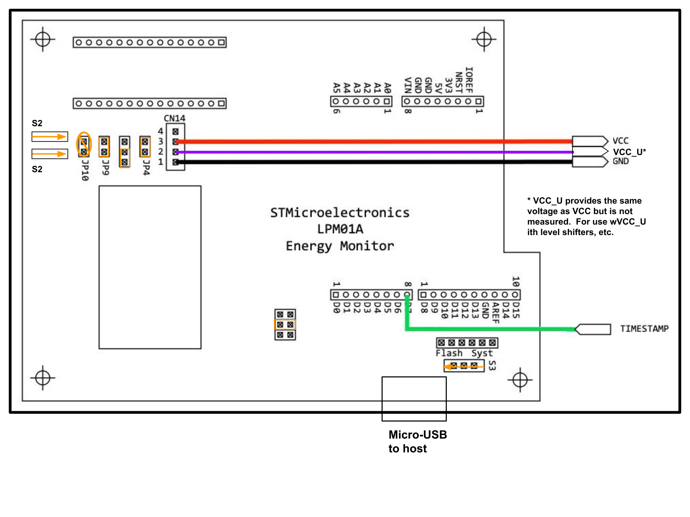

[[_TOC_]]
## Performance/Accuracy Metrics
### Device Configurations
Connect just the device (L4R5ZI) to the computer
### Step 1: Update the Baud Rate
Ensure the DUT board has a file attached and note its **BAUD rate**.  
In `device_under_test.py`, update **line 9** to reflect this baud rate.

### Step 2: Run a Test Trial
Each test trial will be stored in a log file in the local folder.


#### Run the Test in PowerShell:
```powershell
python main.py --dataset_path=C:\Your\Dataset\Path --mode=p
```

Mode for accuracy is a, mode for performance is p. This needs to be lowercase and we default to accuracy.

The dataset path is the location of the dataset files.  If you have used the EEMBC runner previously the dataset files would have a path like `${HOME}$/eembc/runner/benchmarks/ulp-mlperf/datasets`.  Under the datasets directory you should have subdirectories for each of the benchmarks: ad01 (anomaly detection), ic01 (image classification), kws01 (keyword spotting), vww01 (visual wakeword), sww01 (streaming wakeword).

## Energy Test Connections

### Power Board (LPM01A)


### Interface Board (STM32H573I-DK)


The contents of the SD card are only required for the streaming test, but a card must be present in the interface board for it to function for any of the benchmarks.

### Device Under Test (L4R5ZI)


## Streaming Test
The streaming wakeword test is substantially different than the other benchmarks.  It requires the interface board regardless of whether power is being measured in order to deliver the streaming audio over I2S.  Power measurements are required for submissions, but for debugging purposes the streaming test can be run without the energy monitor.

* **SD Card** The SD card stores the wav files that are delivered to the DUT.  Copy the contents of `tiny/benchmark/runner/sd_card/` onto the SD card.
* **Data directory** Copy the contents of `tiny/benchmark/runner/sww_data_dir` into the sub-directory `sww01` under the data directory. This directory includes the primary test file `sww_long_test.json` as well as some smaller test files meant for debugging.  The test file contains a json list of dicts, where each dict contains the following keys:
   * "wav_file" The wav file to play for this test.  It should be available on the SD card.
   * "sample_rate" Sample rate of the wav file.  Currently only 16kS/s has been tested.
   * "length_sec" The length in seconds of the wav file.  This (plus 10 seconds) sets the timeout length for the runner when it instructs the interface board to play the file.
   * "detection_windows": A list of lists.  Each inner list contains the starting time and ending time of one occurrence of the wakeword.
      * Ex `[[1.0, 1.6476250000000001], [7.0, 7.358625]` indicates that the word is being spoken from 1.0s to 1.65s and from 7.0s to 7.36s.  
      * For each occurence of the wakeword the admissible detection window is defined as starting at the beginning of the occurrence and ending 1 second after the end of the occurence. Detections made within this time window are counted as true positives.  If there is no detection made in this time, it is counted as a false negative (aka false rejection). 
         * For example, with the detection windows listed above, a detection recorded by the interface board at 2.60 s would count as a true positive, but a detection at 2.8s would count as a false positive.
         * This timing was selected because the reference model has a one-second backward-looking receptive field.
      * Detections made outside of the admissible detection window count as false positives.  False positives are "debounced" with a 1-second interval. So if a single sound triggers multiple consecutive detections, they will collectively only count as one detection if they all occur within a one second interval.
---

## Test Runner

The test runner connects to the **interface board**, **power board**, and **DUT**. It executes test scripts determined by the hardware configuration.

### Test Scripts `tests.yaml`
#### Example
```yaml
<<model_id>>:
  name: <<test_name>>
  model: <<model_id>>   # the same as above
  truth_file: <<path>> # The path to ground truth values
  script:
    - list
    - of
    - commands
```

#### Syntax

- `download` - Download data to the test device
- `loop` - Run the commands a specified number of times
- `infer` - Run inference for a specified number of cycles
- `stream` - Specific to the streaming benchmark

Benchmarks will generally include a loop that repeats the test over a number of files.  The `model_id` is determined by sending the `profile` command to the DUT and extracting the model string from the DUT's response. The corresponding test is then selected from `tests.yaml`. 
---

### Device Configuration `devices.yaml`
The device file defines available devices that are automatically detected by the `DeviceManager`.

#### Parameters:
- **`name`**: The name of the device
- **`type`**: The device type (`interface` or `power`)
- **`preference`**: The relative importance if two devices are detected. Higher numbers indicate higher preference.
- **`usb`**: `dict` where the key is `vid` and the value is a `pid` or a list of `pid`s.
- **`usb_description`**: A string used to match the USB description.

---

### Device Under Test Configuration `dut.yml`
The `dut.yml` file has been removed and incorporated into `devices.yaml`.

---

## Running the File
Follow these steps to run tests on the device.

### Step 1: Update the Baud Rate
Note the **BAUD rate** of the DUT board.
In `device_under_test.py`, update **line 9** to reflect this baud rate.  Note: this setting is only respected when the DUT is connected directly to the host.  When the interface board is used, the baud rate is set on the interface board. At present, the interface board must be re-compiled to change the baud rate of the interface-DUT connection.  See the notes in the `interface` folder for details.

### Step 2: Configure the Interface Board
If your **interface board** is set up correctly (reference the `interface` folder), you should have **two separate baud rates**:
- One for the DUT board connection.
- One for the computer connection.

The host-interface baud rate defaults to 115200 but can be set by an optional 'baud' setting in the `devices.yaml` file.
As a last-resort debug method, the host-interface baud rate can also be set by modifying `io_manager.py`; update **line 6** to reflect the **computer → interface** baud rate.

### Step 3: Verify Wiring
Double-check the wiring as per the beginning of the README.  
**Note**: No I2C transmission will be used.

For **Power Tests**, follow the energy setup images **exactly**.

For **Accuracy/Energy Tests**:
- TX and RX wiring should be configured identically.
- Ground the interface board to the DUT board.
- Connect the **3.3V** ports of both boards.

### Step 4: Run a Test Trial
Each test trial will be stored in a log file in the local folder.


#### Run the Test in PowerShell:
```powershell
python main.py --dataset_path=C:\Your\Dataset\Path --mode=e
```

You must define mode as e and if for some reason the PowerBoard is not detecting it will return a runtime error.
## Troubleshooting Section

If you encounter errors while running the test, refer to the guide below.

### **Error: 'NoneType' Appears**
This typically indicates a **UART transmission error**.

#### **Steps to Resolve:**
1. **Check your wiring** – Ensure all connections are correct.
2. **Run PowerShell as Administrator** –  
   - On Windows, this error is often caused by restricted access to Serial ports.
   - Open **PowerShell** as an **administrator** and retry the test.
3. **Ensure no other application is using the device ports** –  
   - If another process has locked the ports, the above fixes will not work. This can often happen if you have a terminal (e.g. PuTTY) connected for debug purposes.

---

## FX Media Open Not Working
If `FX_FAT_READ_ERROR` is triggered, there may be **issues with the SD card or its formatting**.

### **Formatting the SD Card (Windows)**
1. Open **Command Prompt** and type:
   ```powershell
   diskpart
   ```
2. This will queue up another terminal for formatting a sd device the run the following commands
   ```powershell
    list disk
    select disk _  // Ensure you select the correct disk
    clean
    create partition primary
    format fs=fat32 quick 
    assign
    exit
   ```

### Baud Rate for Interface board:
Located in file /application/user/core/usart.c
   
