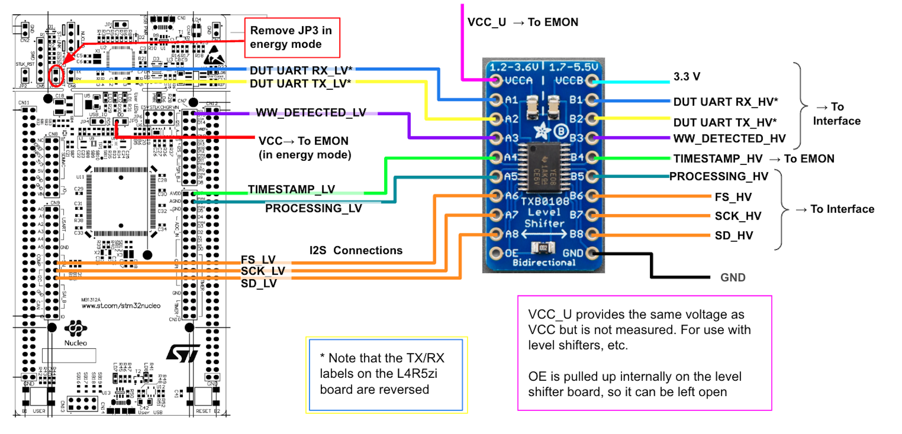

[[_TOC_]]

## General Operation
The runner software in this directory coordinates the running of the MLPerf Tiny benchmarks.  It communicates with the DUT, either directly or through the interface board, as well as with the power monitoring device (e.g. LPM01a, optional except for energy benchmarks) to transmit test data and collect results.  The required connections are described below. The outputs are recorded to a directory "./sessions/YYYYMMDD_HHMMSS/", where YYYYMMDD_HHMMSS is a timestamp.  Messages to and from the connected devices are recorded to "log.txt" in that directory.  The results for submission are in "results.txt" and additional results data is recorded in "results.json" in case additional analysis is desired.  

The main executable is "main.py" and the command line options can be seen by running `main.py --help`.  The options are mainly provided through two yaml files, which describe the devices and the test(s) to be run, respectively.

## Environment
In addition to the python libraries listed in `benchmark/training/streaming_wakeword/requirements.txt`, the runner requires pyusb and libusb.  This dependency is required in order to support the JouleScope JS220, whose USB interface does not behave like a virtual serial port, unlike the LPM01a. 
* **libusb** is the underlying library used to communicate with USB devices.
   * On Windows see [here](https://github.com/pyusb/pyusb/blob/master/docs/faq.rst#how-do-i-install-libusb-on-windows) for installation guidance.
   * On a Mac install it with `$ brew install libusb` (if you have homebrew installed).
      * pyusb will only work with a native libusb library. So if you have an M1/Mx Mac and you have previously installed an x86 version of libusb under Rosetta (typically in `/usr/local/lib/libusb-x.y.z.dylib`) that appears before the native libraries in python's library search order, it will cause a `No backend available` error.
      * STM32 Cube IDE on an M1 Mac installs the Rosetta files, so if you are using that for STM32 development (e.g. if you want to compile the SWW reference or the interface software), you cannot delete the files.  It will cause a "No ST-Link found" error.  You can direct python to prioritize the native library by running the code with the `DYLD_LIBRARY_PATH` variable set.  
         `DYLD_LIBRARY_PATH=/opt/homebrew/lib python main.py ...`.
   * On Linux it should already be installed with most distributions.
* **pyusb** is a python wrapper to libusb.  It should typically install with `python -m pip install pyusb`
   * See the package [FAQ](https://github.com/pyusb/pyusb/blob/master/docs/faq.rst) for troubleshooting tips.
* If you are using the JouleScope you will also need to install its python API, pyjoulescope, with `python -m pip install joulescope`.  See [this page](https://joulescope.readthedocs.io/en/latest/user/install.html) for more information.


## Configuration Files

### `devices.yaml`
Specified by the command line option `-d` or `--device_list`, this yaml file lists all of the devices used in the test, specifically the energy monitor board, the DUT, and the interface board.  Defaults to `devices.yaml`, which is the default/example  file is provided in the repo.  Each device has several attributes:
* **name** Largely arbitrary but should be unique within the yaml file.
* **type** Either `interface`, `power`, or `dut`. 
* **preference** If there are multiple interface boards connected and specified in the file, the one with the _highest_ preference will be used.
* **echo** Optional, defaults to False.  If set to True, all of the commands sent to and received from this device will be printed to the terminal and recorded to the log file.
* **baud** The baud rate between this device and its immediate upstream connection.  I.e. for the power manager or the interface board, this is the baud rate of connection between that device and the host.  For the DUT, this is the baud rate between the DUT and either the host (for a direct connection) or the interface board (for an indirect connection).
* usb: A pair of hex values specifying the VID and PID of the devices usb connection.

### `tests.yaml`


## Communications
### Host <==> DUT
For performance and accuracy tests, the host can be directly connected to the DUT. The baud rate is configurable by setting the `baud` parameter in the appropriate element in `devices.yaml`.  The baud rate can either be a single integer baud rate, which will be used for all tests, or a dictionary with keys `energy`, `performance`, `accuracy`.  The default `devices.yaml` included in this repo uses the dictionary for the L4R5zi reference DUT.  If you need different baud rates for different benchmarks (e.g. for anomaly detection vs. streaming wakeword) you can use different devices files (e.g. `devices_ad.yaml` and `devices_sww.yaml`) and pass them on the command line using the `--device_list` flag.  

### Host <==> Interface Board
The host communicates with the interface board via a 115200 baud virtual serial port over USB.

### Interface Board <==> DUT
For the energy mode measurements, the interface board communicates with the DUT over a UART.

## Performance/Accuracy Metrics
### Device Configurations
Connect just the device (L4R5ZI) to the computer
### Step 1: Update the Baud Rate
Ensure the DUT board has a file attached and note its **BAUD rate**.  
In `device_under_test.py`, update **line 9** to reflect this baud rate.

### Step 2: Run a Test Trial
Each test trial will be stored in a log file in the local folder.


#### Run the Test in PowerShell:
```powershell
python main.py --dataset_path=C:\Your\Dataset\Path --mode=p
```

Mode for accuracy is a, mode for performance is p. This needs to be lowercase and we default to accuracy.

The dataset path is the location of the dataset files.  If you have used the EEMBC runner previously the dataset files would have a path like `${HOME}$/eembc/runner/benchmarks/ulp-mlperf/datasets`.  Under the datasets directory you should have subdirectories for each of the benchmarks: ad01 (anomaly detection), ic01 (image classification), kws01 (keyword spotting), vww01 (visual wakeword), sww01 (streaming wakeword).

#### Running Specific Benchmarks

* Image Classification
   * Energy: `python main.py --dataset_path=/path/to/datasets/ --test_script=tests_energy.yaml --device_list=devices_kws_ic_vww.yaml --mode=e`
   * Performance: `python main.py --dataset_path=/path/to/datasets/ --test_script=tests_performance.yaml --device_list=devices_kws_ic_vww.yaml --mode=p`
   * Accuracy: `python main.py --dataset_path=/path/to/datasets/ --test_script=tests_accuracy.yaml --device_list=devices_kws_ic_vww.yaml --mode=a`
* Keyword Spotting
   * Energy: `python main.py --dataset_path=/path/to/datasets/ --test_script=tests_energy.yaml --device_list=devices_kws_ic_vww.yaml --mode=e`
   * Performance: `python main.py --dataset_path=/path/to/datasets/ --test_script=tests_performance.yaml --device_list=devices_kws_ic_vww.yaml --mode=p`
   * Accuracy: `python main.py --dataset_path=/path/to/datasets/ --test_script=tests_accuracy.yaml --device_list=devices_kws_ic_vww.yaml --mode=a`
* Visual Wakewords:
   * Energy: `python main.py --dataset_path=/path/to/datasets/ --test_script=tests_energy.yaml --device_list=devices_kws_ic_vww.yaml --mode=e`
   * Performance: `python main.py --dataset_path=/path/to/datasets/ --test_script=tests_performance.yaml --device_list=devices_kws_ic_vww.yaml --mode=p`
   * Accuracy: `python main.py --dataset_path=/path/to/datasets/ --test_script=tests_accuracy.yaml --device_list=devices_kws_ic_vww.yaml --mode=a`
* Anomaly Detection:
   * Energy:  `python main.py --dataset_path=/path/to/datasets/ --test_script=tests_energy.yaml --device_list=devices_ad.yaml --mode=e`
   * Performance: `python main.py --dataset_path=/path/to/datasets/ --test_script=tests_performance.yaml --device_list=devices_ad.yaml --mode=p`
   * Accuracy: `python main.py --dataset_path=/path/to/datasets/ --test_script=tests_accuracy.yaml --device_list=devices_ad.yaml --mode=a`
* Streaming Wakeword
   * SWW measures performance, accuracy, and accuracy in one run.  It should be run in energy mode.
   * Energy: `python main.py --dataset_path=/path/to/datasets/ --test_script=tests_energy.yaml --device_list=devices_sww.yaml --mode=e`


## Energy Test Connections
The hardware connections are illustrated here. Not all connections will be needed for every trial.  For tests other than the audio streaming benchmark, the I2S connections, "PROCESSING", and "WW_DETECTED" can be omitted.  For those tests (KWS, IC, AD, VWW) run in accuracy or performance mode, the interface board can also be removed from the system.  In that scenario, the only connection needed is to connect the host to the DUT via USB.  If the DUT does not have a USB connection, or you wish to use a UART that is not connected to a USB port, you can use a USB-UART bridge, such as the [FTDI Friend](https://www.adafruit.com/product/284).

### Power Board (LPM01A)


### Interface Board (STM32H573I-DK)


The interface board runs at 3.3V, so if the DUT is running at any other supply voltage, the logic levels must be shifted.  The TXB0108, available in a [breakout board](https://www.adafruit.com/product/395) from Adafruit, support low-side voltages from 1.2V to 3.6V.

The STM32H573I-DK board has a slot for a micro-SD card. The contents of the SD card are only required for the streaming test, but a card must be present in the interface board for it to function for any of the benchmarks. Ensure that it is formatted as an MS-DOS (FAT32) disk.  A 1GB card is plenty for the current benchmarks.

### Device Under Test (L4R5ZI)


## Streaming Test
The streaming wakeword test is substantially different than the other benchmarks.  It requires the interface board regardless of whether power is being measured in order to deliver the streaming audio over I2S.  Power measurements are required for submissions, but for debugging purposes the streaming test can be run without the energy monitor.

* **SD Card** The SD card stores the wav files that are delivered to the DUT.  Copy the contents of `tiny/benchmark/runner/sd_card/` onto the SD card.
* **Data directory** Copy the contents of `tiny/benchmark/runner/sww_data_dir` into the sub-directory `sww01` under the data directory. This directory includes the primary test file `sww_long_test.json` as well as some smaller test files meant for debugging.  The test file contains a json list of dicts, where each dict contains the following keys:
   * "wav_file" The wav file to play for this test.  It should be available on the SD card.
   * "sample_rate" Sample rate of the wav file.  Currently only 16kS/s has been tested.
   * "length_sec" The length in seconds of the wav file.  This (plus 10 seconds) sets the timeout length for the runner when it instructs the interface board to play the file.
   * "detection_windows": A list of lists.  Each inner list contains the starting time and ending time of one occurrence of the wakeword.
      * Ex `[[1.0, 1.6476250000000001], [7.0, 7.358625]` indicates that the word is being spoken from 1.0s to 1.65s and from 7.0s to 7.36s.  
      * For each occurence of the wakeword the admissible detection window is defined as starting at the beginning of the occurrence and ending 1 second after the end of the occurence. Detections made within this time window are counted as true positives.  If there is no detection made in this time, it is counted as a false negative (aka false rejection). 
         * For example, with the detection windows listed above, a detection recorded by the interface board at 2.60 s would count as a true positive, but a detection at 2.8s would count as a false positive.
         * This timing was selected because the reference model has a one-second backward-looking receptive field.
      * Detections made outside of the admissible detection window count as false positives.  False positives are "debounced" with a 1-second interval. So if a single sound triggers multiple consecutive detections, they will collectively only count as one detection if they all occur within a one second interval.

Steps to run the streaming benchmark:
1. Ensure the power board, the interface board, and the DUT are all connected as shown above.
2. Ensure that the SD card in the interface board holds the wav files in the `runner/sd_card` directory.
3. The json files from the `runner/sww_data_dir` directory are in `DATA_DIRECTORY/sww01`, where `DATA_DIRECTORY` will be specified with the `--dataset_path` on the command line.
4. The test you run will be determined by the `sww01.truth_file` value in `tests.yaml`.  It is recommended to start with the the short test (`truth_file: sww_short_test.json`), a 10-second wav file.  The current model has 2 true positive and 1 false negatives on this file.
5. Run the test with `main.py --dataset_path=DATA_DIRECTORY --test_script=tests.yaml`.

---
## Test Runner

The test runner connects to the **interface board**, **power board**, and **DUT**. It executes test scripts determined by the hardware configuration.

### Test Scripts `tests.yaml`
#### Example
```yaml
<<model_id>>:
  name: <<test_name>>
  model: <<model_id>>   # the same as above
  truth_file: <<path>> # The path to ground truth values
  script:
    - list
    - of
    - commands
```

#### Syntax
The script listed in `tests.yaml` uses a combination of four commands, listed below.  Benchmarks will generally include a loop that repeats the test over a number of files.  The `model_id` is determined by sending the `profile` command to the DUT and extracting the model string from the DUT's response. The corresponding test is then selected from `tests.yaml`. 

- `download` - Download data to the test device
- `loop` - Run the commands a specified number of times
- `infer` - Run inference for a specified number of cycles
- `stream` - Specific to the streaming benchmark.  Plays the wav file listed in `truth_file`, instructs the DUT to detect wake words, and instructs the interface board to record those detections.  At the end of the wav file, the interface board will transmit a list of the detection times to the host, which will calculate true positives, false positives, and false negatives. 

---

### Device Configuration `devices.yaml`
The device file defines available devices that are automatically detected by the `DeviceManager`.

#### Parameters:
- **`name`**: The name of the device
- **`type`**: The device type (`interface` or `power`)
- **`preference`**: The relative importance if two devices are detected. Higher numbers indicate higher preference.
- **`usb`**: `dict` where the key is `vid` and the value is a `pid` or a list of `pid`s.
- **`usb_description`**: A string used to match the USB description.

---

### Device Under Test Configuration `dut.yml`
The `dut.yml` file has been removed and incorporated into `devices.yaml`.

---

## Running the File
Follow these steps to run tests on the device.

### Step 1: Update the Baud Rate
Note the **BAUD rate** of the DUT board.
In `device_under_test.py`, update **line 9** to reflect this baud rate.  Note: this setting is only respected when the DUT is connected directly to the host.  When the interface board is used, the baud rate is set on the interface board. At present, the interface board must be re-compiled to change the baud rate of the interface-DUT connection.  See the notes in the `interface` folder for details.

### Step 2: Configure the Interface Board
If your **interface board** is set up correctly (reference the `interface` folder), you should have **two separate baud rates**:
- One for the DUT board connection.
- One for the computer connection.

The host-interface baud rate defaults to 115200 but can be set by an optional 'baud' setting in the `devices.yaml` file.
As a last-resort debug method, the host-interface baud rate can also be set by modifying `io_manager.py`; update **line 6** to reflect the **computer → interface** baud rate.

### Step 3: Verify Wiring
Double-check the wiring as per the beginning of the README.  
**Note**: No I2C transmission will be used.

For **Power Tests**, follow the energy setup images **exactly**.

For **Accuracy/Energy Tests**:
- TX and RX wiring should be configured identically.
- Ground the interface board to the DUT board.
- Connect the **3.3V** ports of both boards.

### Step 4: Run a Test Trial
Each test trial will be stored in a log file in the local folder.


#### Run the Test in PowerShell:
```powershell
python main.py --dataset_path=C:\Your\Dataset\Path --mode=e
```

You must define mode as e and if for some reason the PowerBoard is not detecting it will return a runtime error.
## Troubleshooting Section

If you encounter errors while running the test, refer to the guide below.

### General Troubleshooting
* If your device can operate on a 3.3V supply, you may find it helpful to run at 3.3V initially, and omit the level shifters.  This will increase the energy consumption, but remove the level shifters as a potential problem.

### "RuntimeError: No response to command name"
*  This typically means that the host or interface board cannot communicate with the DUT, because the "name" command is the first 
command sent to the DUT.  Make sure that the DUT is correctly powered, the baud rate is correctly specified (noting that you may specify 
different baud rates for energy/performance/accuracy modes), and that the UART wires are correctly connected if not connecting directly to the DUT.
If you're using the L4R5zi reference board, remember that the Tx/Rx lines are labeled backwards.

### **Error: 'NoneType' Appears**
This typically indicates a **UART transmission error**.

#### **Steps to Resolve:**
1. **Check your wiring** – Ensure all connections are correct.
2. **Run PowerShell as Administrator** –  
   - On Windows, this error is often caused by restricted access to Serial ports.
   - Open **PowerShell** as an **administrator** and retry the test.
3. **Ensure no other application is using the device ports** –  
   - If another process has locked the ports, the above fixes will not work. This can often happen if you have a terminal (e.g. PuTTY) connected for debug purposes.

### Error: SerialException or ResourceBusy
The full text of this error (at least on a Mac) is : "Exception has occurred: SerialException
device reports readiness to read but returned no data (device disconnected or multiple access on port?)".  
It is typically caused by having a serial terminal (e.g. putty, picocom) open on the power manager.  Similarly, if another application
has the DUT or interface board open, you may receive an error like this: "[Errno 16] could not open port /dev/cu.usbmodem1403: [Errno 16] Resource busy: '/dev/cu.usbmodem1403'"

### Error: Power Manager did not acknowledge.
This will then often be followed with a list of strings, which are messages from the power manager, such as `['33930-08','33340-08','ack']`.  If this is the case, it is typically because the power manager had messages in its output queue from a previous run.  Those cause the runner to miss the acknowledgement the power manager and fail.  Simply run the runner again.

If there are no messages in the list, then the power manager may be disconnected.  Make sure it is connected and powered.  You may find it helpful to connect to it with a serial terminal to check that it is present and communicating.

---

## FX Media Open Not Working
If `FX_FAT_READ_ERROR` is triggered, there may be **issues with the SD card or its formatting**.

### **Formatting the SD Card (Windows)**
1. Open **Command Prompt** and type:
   ```powershell
   diskpart
   ```
2. This will queue up another terminal for formatting a sd device the run the following commands
   ```powershell
    list disk
    select disk _  // Ensure you select the correct disk
    clean
    create partition primary
    format fs=fat32 quick 
    assign
    exit
   ```

## I2S Audio Transfer
If the I2S transfer appears not to be working, here are a few things to try.
1. To run a shorter test, change the 'truth_file' value under the sww section to `sww_short_test.json` (10 seconds) or `sww_med_test.json` (2 minutes).
2. To reduce the number of connections, you can run the test without the power board and with the the host connected directly to the DUT's USB virtual UART, although the interface board is still necessary for delivering I2S signals.  The runner will detect the connection and issue commands directly to the DUT rather than going through the interface board.  This setup will also let you use the step debugger in the DUT.  In this arrangement, make sure that the UART wires are disconnected so they don't contend with the USB UART and make sure the IDD jumper is in place, since the DUT is being powered through the USB connection.
3. 

### Baud Rate for Interface board:
Located in file /application/user/core/usart.c
   
